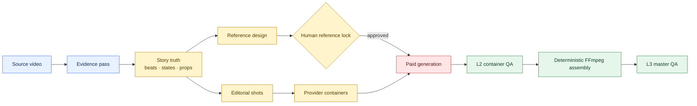

<div align="center">

[简体中文](README.md) · **English**

# ChronoForge

**A causality-first agent skill for recreating videos longer than a generation model's clip limit.**

[](https://github.com/peipeijiang/chronoforge/actions/workflows/validate.yml)
[](SKILL.md)
[](https://www.python.org/)
[](https://ffmpeg.org/)
[](README.md)

</div>

Short-video models generate clips; stories run longer. ChronoForge turns a source video into evidence, immutable story truth, locked references, fixed-duration generation containers, deterministic assembly, and layered QA. Its central rule is simple: **story truth is immutable; provider clips are packaging**.

ChronoForge targets reference-locked structural and semantic reenactment. It does not promise pixel-perfect cloning, motion identity, or exact likeness, and it requires appropriate rights to the source and reference material.

## Why ChronoForge

Naive equal slicing preserves duration while destroying meaning. It can keep a character wearing a mask but lose the odor that caused it, show trash without the setup, or preserve a reaction after replacing its cause.

ChronoForge makes those dependencies explicit:

- cause → visible action → reaction → consequence/payoff;
- character state and prop lifecycles across cuts;
- immutable editorial shots separated from provider-sized containers;
- a human reference-lock gate before paid video generation;
- L1/L2/L3 QA with retakes assigned to the earliest responsible layer;
- serialized paid submissions with an append-only job ledger.

## How it works



The editorial timeline remains the source of truth even when a provider only outputs fixed 10-second clips. A 33.1-second source may become four 10-second jobs, retain `10 + 7 + 10 + 6.1` seconds, and then be assembled back to the editorial duration.

## Quick start

### 1. Install the skill

Requirements: a `SKILL.md`-compatible agent host such as Codex, Python 3.10+, `ffmpeg`, and `ffprobe`.

```bash
git clone https://github.com/peipeijiang/chronoforge.git \
  ~/.agents/skills/chronoforge
```

Start from your agent with a source video:

```text
$chronoforge analyze and recreate /path/to/source.mp4 using 10-second provider clips
```

### 2. Initialize a non-paid run

From the skill directory:

```bash
python3 scripts/init_run.py /path/to/source.mp4 \
  --out /path/to/run \
  --provider-clip-seconds 10 \
  --aspect-ratio 9:16
```

This probes and hashes the source, creates the run structure, and initializes the append-only ledger. It does not call a provider.

### 3. Compile and validate story truth

Use [`assets/story-truth.example.json`](assets/story-truth.example.json) and [`assets/timeline.example.json`](assets/timeline.example.json) as schema examples, then validate your populated manifests:

```bash
python3 scripts/validate_story.py /path/to/run/analysis/story-truth.json
python3 scripts/validate_timeline.py /path/to/run/manifests/timeline.json
```

Stop for human approval after reference assets pass L1 QA. Paid video submission must not begin before that reference pack is locked.

### 4. Validate and submit provider jobs

The bundled adapter currently allow-lists UpDrama `gpt-image-2` and `omni_flash-10s`. Export the key only in your shell—never place it in a request or manifest.

```bash
export UPDRAMA_API_KEY="<your-key>"

python3 scripts/updrama_runtime.py preflight
python3 scripts/updrama_runtime.py validate assets/omni-request.example.json
```

Submitting is paid and requires an explicit confirmation phrase:

```bash
python3 scripts/updrama_runtime.py submit /path/to/run/requests/video/C01.json \
  --run-dir /path/to/run \
  --job-id C01-v1 \
  --confirm-paid I_UNDERSTAND_THIS_IS_PAID

python3 scripts/updrama_runtime.py status <task-id> \
  --run-dir /path/to/run
```

The adapter writes a submit intent before the POST, serializes creates on Unix-like systems, and records ambiguous submissions without retrying them in the same invocation. It is not a provider-level idempotency guarantee: resolve any `unknown_submission` before manually submitting again.

### 5. Assemble the accepted containers

Place the assembly manifest at the run root if it uses paths such as `media/containers/...`, because paths resolve relative to the manifest.

```bash
cp assets/assembly.example.json /path/to/run/assembly.json
# Adapt the container list and retained durations first.
python3 scripts/assemble.py /path/to/run/assembly.json
```

The assembler normalizes geometry, frame rate, pixel format, and audio before trimming and concatenation. It prints the encoded probe data so the final duration and streams can be checked.

## The fidelity contract

| Layer | Accepts | Rejects or retakes |
|---|---|---|
| L1 · References | identity, environment, prop state, role isolation | wrong state, reference contamination, missing story-bearing object |
| L2 · Raw containers | required beats in order, action completion before trim, continuity | technically valid clip with reversed or missing causality |
| L3 · Master | exact editorial order, seams, A/V continuity, setup/payoff | assembly defects; these never trigger a paid generation retake |

Retake the earliest responsible layer and change one variable per controlled retry. A technical pass is not a story pass.

## A 33-second example

The workflow that motivated ChronoForge was a 33.111723-second cat-café short. An early recreation preserved several visible objects but misunderstood the joke: a worker wears a mask because litter-box odor spreads, disposes of the waste, and the sequence resolves into a coffee-bean visual pun. Losing the cause made the mask, trash, and payoff look arbitrary.

The corrected topology kept the original editorial beats and used four 10-second generation containers:

| Container | Source range | Generated | Retained |
|---|---:|---:|---:|
| C01 | 0–10 s | 10 s | 10 s |
| C02 | 10–17 s | 10 s | 7 s |
| C03 | 17–27 s | 10 s | 10 s |
| C04 | 27–33.111723 s | 10 s | 6.111723 s |

The extra generated tails are packaging overhead, not new editorial material. Short containers must complete their action before the trim point and hold a stable end state afterward.

## Included tools

| Script | Purpose | Paid |
|---|---|---:|
| `init_run.py` | probe/hash the source and initialize a run | No |
| `validate_story.py` | reject missing causal and payoff links | No |
| `validate_timeline.py` | verify editorial and container coverage | No |
| `updrama_runtime.py` | preflight, validate, submit, and inspect jobs | Submit only |
| `assemble.py` | normalize, trim, concatenate, and probe the master | No |

The deeper contracts live in [`references/story-compiler.md`](references/story-compiler.md), [`references/provider-runtime.md`](references/provider-runtime.md), and [`references/qa-contract.md`](references/qa-contract.md).

## Known limits

- ChronoForge is an agent-guided production protocol, not a one-command automatic video cloner.
- Source-video semantic analysis is routed to an installed analysis skill such as `watch`; it is not bundled here.
- The current provider adapter is UpDrama-specific and its runtime contract can drift. Always run `preflight` before paid work.
- `status` records result URLs but does not download or hash media automatically.
- The assembler expects video and audio in every input, uses centered scale-and-crop, and outputs H.264/AAC.
- Paid-create file locking uses `fcntl`, so the current adapter targets macOS and Linux.
- Initialization currently supports `9:16` and `16:9`.

## License

No license has been selected yet. The source is publicly viewable, but reuse requires the owner's permission until a license is added.
