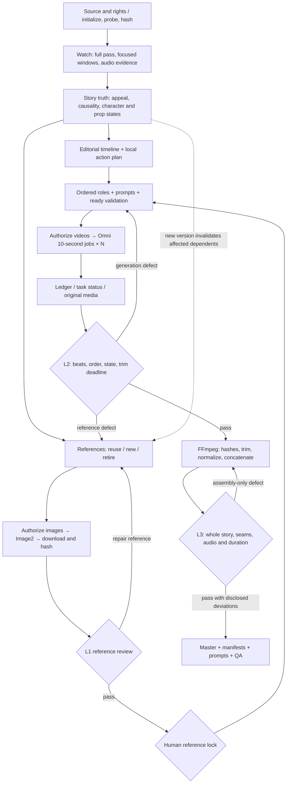

<div align="center">

[简体中文](README.md) · **English**

# ChronoForge · v2

An agent skill for source-led long-video recreation: understand, lock references, generate segments, verify and assemble.

[](https://github.com/peipeijiang/chronoforge/actions/workflows/validate.yml)

</div>

ChronoForge recreates videos longer than a model's single-clip limit using UpDrama **gpt-image-2** for references, **omni_flash-10s** for video, and FFmpeg for local assembly. No LoRA training is required; provider API generation still costs money.

The target is reference-guided structural and semantic recreation, not pixel, motion or original-audio identity. Appropriate rights to source and reference material are required.

## Core capabilities

- **Understand the whole story:** analyze appeal, causes, actions, reactions and payoffs; separate facts from inference.
- **Preserve visual continuity:** assign identity, environment, prop and action-state references to ordered control roles.
- **Exceed the clip limit:** separate editorial truth from provider jobs and complete required actions before each trim point.
- **Track accepted versions:** bind references, QA and human locks to hashes; invalidate declared downstream dependencies when truth changes.
- **Resume safely:** persist intent before POST, reuse known jobs, and reconcile ambiguous submissions before another charge.
- **Review and repair locally:** L1 references, L2 raw clips, L3 master; assembly-only defects never require paid regeneration.

## Complete workflow



Reference lock is the routine creative human gate. Paid batches and retries outside existing authorization need separate approval. Image2 generation happens before image review and lock.

| Stage | Output / prompt focus | Actual tool or model | Design provenance |
|---|---|---|---|
| Source analysis | timed evidence, appeal, facts and uncertainty | Watch + ffprobe/FFmpeg | watch / claude-video |
| Story and continuity | cause→action→reaction→result, state tracks | Agent + structural validators | ChronoForge; earlier drama-skills / LuxReal research |
| References | identities, environment, props, action states and control boundaries | UpDrama gpt-image-2 | ChronoForge reference protocol |
| Video planning | ordered roles, local timing, cuts, deadline, audio, exclusions | Agent; omni_flash-10s | ChronoForge; earlier storyboard/video-prompts research |
| Execution | current API contract, intent, status, media hashes | updrama_runtime.py | Original UpDrama integration notes and production adapter |
| QA and retakes | per-beat evidence, continuity, seams, disclosed deviations | Agent + media_qa.py | ChronoForge L1/L2/L3 |
| Assembly | retained ranges, cumulative frame budgets, encoding specification | FFmpeg + assemble.py | Original production assembly |

Design provenance does not mean all those skills run every time or ship in this repository. Watch is an external analysis dependency; ChronoForge remains the orchestrator.

## Recreating longer videos with a fixed 10-second model

One 33.111723-second case used:

| Container | Generated | Retained | Tail |
|---|---:|---:|---|
| C01 | 10 s | 10 s | None |
| C02 | 10 s | 7 s | Stable completed pose, trimmed |
| C03 | 10 s | 10 s | None |
| C04 | 10 s | 6.111723 s | Stable completed pose, trimmed |

Four jobs yield 40 seconds of source material for an editorial target of 33.111723 seconds. At 60 fps, 1987 frames encode approximately 33.116667 seconds, a +0.004944-second quantization delta. This topology is an example, not a universal template. Observed source cuts and generated local cuts are recorded separately.

## Install and start

Requirements: a `SKILL.md`-compatible agent, Python 3.10+, FFmpeg and ffprobe. The paid adapter currently targets macOS/Linux.

```bash
git clone --branch v2 https://github.com/peipeijiang/chronoforge.git ~/.agents/skills/chronoforge
```

Back up an existing installation and preserve uncommitted edits. Invoke from your agent:

```text
$chronoforge Analyze and recreate /path/to/source.mp4.
Use UpDrama Image2 and omni_flash-10s.
Start with story analysis, reference planning and non-paid validation.
```

Initialize a non-paid run from the skill directory:

```bash
python3 scripts/init_run.py /path/to/source.mp4 --out /path/to/run --provider-clip-seconds 10 --aspect-ratio 9:16
```

Continue through [SKILL.md](SKILL.md). The [artifact guide](references/reference-execution.md) covers registration, QA, lock, invalidation and acceptance. The [paid runtime guide](references/provider-runtime.md) covers preflight, submission, recovery and downloads.

The key is read only from `UPDRAMA_API_KEY`; never put it in manifests or Git. The repository does not automatically read keys from chat.

## Included scripts

| Script | Purpose | Paid |
|---|---|---|
| init_run.py | initialization, source probe/hash | No |
| validate_story.py / validate_timeline.py | structural story and timeline checks | No |
| validate_plan.py | required beat coverage, reference roles, trim deadlines, QA records | No |
| workflow.py | artifacts, dependency hashes, QA, human lock, downstream invalidation | No |
| updrama_runtime.py | snapshots, planned/ready validation, submit, recovery, collection | Submit only |
| media_qa.py | full decode, probe, timestamped evidence; semantic judgment remains pending | No |
| assemble.py | input hashes, cumulative frame budgets, trim, concatenate, report | No |

Run offline tests:

```bash
python3 -m unittest discover -s tests -v
```

## v2 restoration and limitations

The [restoration audit](references/v2-restoration-audit.md) maps historical production gaps to corrections and evidence limits. The [sanitized case](assets/cat-coffee-v3/execution-plan.json) contains a full segment plan, ordered reference roles and historical Image2/Omni prompts. Video V3 is distinct from the skill's v2 branch. No private media, URLs or valid approval are supplied; the case cannot be submitted as-is.

This is an agent-guided protocol, not a one-command cloner. Structural checks cannot understand a story; approval records do not establish real consent; dependency checks cannot discover undeclared relationships. Provider snapshots require review. This upgrade did not revalidate live model quality or initiate paid generation. The assembler supports generated audio or a silent master; source-audio reuse needs a separately verified synchronization workflow.

## License

No license has been selected. The source is publicly viewable; reuse requires the owner's permission until a license is added.
