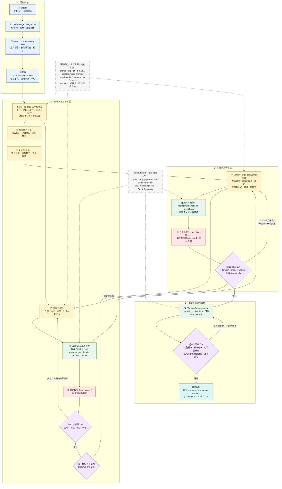

<div align="center">

**简体中文** · [English](README.en.md)

# ChronoForge

**一个因果优先的 Agent Skill：把超过单次生成时长的源视频，复刻为完整长视频。**

[](https://github.com/peipeijiang/chronoforge/actions/workflows/validate.yml)
[](SKILL.md)
[](https://www.python.org/)
[](https://ffmpeg.org/)
[](README.en.md)

</div>

短视频模型只能生成片段，但故事通常更长。ChronoForge 把源视频编译为证据、不可变的故事真值、锁定参考图、固定时长的生成容器、确定性拼接和分层 QA。它的核心原则是：**故事真值不可变，模型片段只是包装。**

ChronoForge 的目标是“参考锁定的结构与语义复刻”，不承诺逐像素克隆、运动完全一致或身份完全一致；使用者必须拥有源视频与参考素材的相应权利。

## 核心功能

ChronoForge 把长视频复刻拆成四类可验证数据：源片证据、编辑真值、模型执行请求和成片验收记录。它先完整分析源片，再把镜头、动作顺序、人物状态、道具变化和音频意图编译为不受模型单次时长限制的编辑时间线；参考图和固定时长视频只在真值冻结后生成。

- **完整源片取证**：记录媒体参数、时间码、画面观察、转写、音频线索和不确定项，避免只根据少量抽帧编写提示词。
- **故事与连续性契约**：为每个镜头保存原因、动作、反应、结果、人物状态、道具状态以及必须保留/允许变化的字段。
- **编辑镜头与模型任务分离**：编辑镜头保持原始起止时间；模型容器只负责把相邻镜头包装成供应商允许的固定时长任务。
- **参考图编译与人工锁定**：把人物、场景、道具和关键状态分配到有序参考槽；参考图通过 L1 QA 并由用户锁定后，才能提交视频生成。
- **安全的付费执行**：每批调用前刷新模型契约，POST 前写入提交意图，串行创建任务，并对结果不明的提交禁用盲目重试。
- **分层 QA 与确定性装配**：L1 验参考图、L2 验原始视频容器、L3 验最终母版；仅将通过的片段交给 FFmpeg 精确裁剪、标准化和拼接。

## 工作原理



实线节点属于 ChronoForge 的实际运行链；灰色虚线节点只表示设计规范或局部代码来源，不会作为第二套总控运行。红色节点会产生模型费用，紫色菱形是验收与回退点。

即使模型每次只能输出固定 10 秒，编辑时间线仍然是唯一真值。一个 33.1 秒源视频可以提交四个 10 秒任务，实际保留 `10 + 7 + 10 + 6.1` 秒，再按原始故事时长拼回去。

## 快速开始

### 1. 安装 Skill

需要支持 `SKILL.md` 的 Agent 宿主（例如 Codex）、Python 3.10+、`ffmpeg` 和 `ffprobe`。

```bash
git clone https://github.com/peipeijiang/chronoforge.git \
  ~/.agents/skills/chronoforge
```

在 Agent 中提供源视频并调用：

```text
$chronoforge 分析并复刻 /path/to/source.mp4，视频模型每段固定 10 秒
```

### 2. 初始化非付费 Run

在 Skill 目录执行：

```bash
python3 scripts/init_run.py /path/to/source.mp4 \
  --out /path/to/run \
  --provider-clip-seconds 10 \
  --aspect-ratio 9:16
```

这一步只探测并哈希源视频、创建目录和初始化追加式账本，不会调用任何付费模型。

### 3. 编译并验证故事真值

参考 [`assets/story-truth.example.json`](assets/story-truth.example.json) 和 [`assets/timeline.example.json`](assets/timeline.example.json) 填写实际清单，然后验证：

```bash
python3 scripts/validate_story.py /path/to/run/analysis/story-truth.json
python3 scripts/validate_timeline.py /path/to/run/manifests/timeline.json
```

参考图通过 L1 QA 后必须停下来等待人工确认。参考包没有锁定前，不得提交付费视频任务。

### 4. 验证并提交模型任务

当前适配器只允许 UpDrama 的 `gpt-image-2` 与 `omni_flash-10s`。API Key 只能导出到当前 Shell，禁止写入请求或清单。

```bash
export UPDRAMA_API_KEY="<your-key>"

python3 scripts/updrama_runtime.py preflight
python3 scripts/updrama_runtime.py validate assets/omni-request.example.json
```

提交任务会产生费用，因此命令要求显式确认：

```bash
python3 scripts/updrama_runtime.py submit /path/to/run/requests/video/C01.json \
  --run-dir /path/to/run \
  --job-id C01-v1 \
  --confirm-paid I_UNDERSTAND_THIS_IS_PAID

python3 scripts/updrama_runtime.py status <task-id> \
  --run-dir /path/to/run
```

适配器会在 POST 前写入提交意图，在类 Unix 系统上串行创建任务，并记录结果不明的提交，同时拒绝在同一次调用中自动重试。但这不是服务端幂等保证：出现 `unknown_submission` 后，必须先对账，再决定是否人工重提。

### 5. 拼接已验收的容器

若路径写成 `media/containers/...`，请把 assembly 清单放在 Run 根目录，因为相对路径以清单位置为基准。

```bash
cp assets/assembly.example.json /path/to/run/assembly.json
# 先根据实际容器与保留时长修改清单。
python3 scripts/assemble.py /path/to/run/assembly.json
```

拼接器会统一画面尺寸、帧率、像素格式与音频，再裁剪和串联，并输出编码后的 probe 数据，用于核验时长和音视频流。

## 复刻验收契约

| 层级 | 验收内容 | 拒绝或返工条件 |
|---|---|---|
| L1 · 参考图 | 身份、环境、道具状态、角色隔离 | 状态错误、参考污染、故事关键道具缺失 |
| L2 · 原始容器 | 必要节拍与顺序、裁剪点前完成动作、连续性 | 技术合格，但因果倒置或关键动作缺失 |
| L3 · 母版 | 编辑顺序、接缝、音画连续、伏笔回收 | 仅修复拼接问题，绝不因此触发付费重生成 |

返工应定位到最早责任层，每次受控重试只改一个变量。技术通过，不代表故事通过。

## 固定时长模型的长视频编排示例

假设源视频时长为 33.111723 秒，分析后得到 8 个连续编辑镜头，而视频模型每次固定输出 10 秒。ChronoForge 不会改写这 8 个镜头的原始时间，而是根据语义相邻关系将它们编译为 4 个执行容器：

| 容器 | 编辑镜头 | 源时间范围 | 模型生成 | 母版保留 | 多余尾部处理 |
|---|---|---:|---:|---:|---|
| C01 | S01–S02 | 0–10 秒 | 10 秒 | 10 秒 | 无 |
| C02 | S03–S04 | 10–17 秒 | 10 秒 | 7 秒 | 7–10 秒为稳定 hold，随后裁掉 |
| C03 | S05–S06 | 17–27 秒 | 10 秒 | 10 秒 | 无 |
| C04 | S07–S08 | 27–33.111723 秒 | 10 秒 | 6.111723 秒 | 6.111723–10 秒为稳定 hold，随后裁掉 |

最终母版时长为 `10 + 7 + 10 + 6.111723 = 33.111723` 秒。模型容器只改变执行拓扑，不改变编辑镜头真值；某个容器生成失败时只重做该容器，纯裁剪或拼接错误只返回 FFmpeg，不触发付费重生成。

## 内置工具

| 脚本 | 用途 | 是否付费 |
|---|---|---:|
| `init_run.py` | 探测/哈希源视频并初始化 Run | 否 |
| `validate_story.py` | 拒绝缺少因果或回收关系的故事清单 | 否 |
| `validate_timeline.py` | 检查编辑镜头与模型容器覆盖 | 否 |
| `updrama_runtime.py` | 预检、验证、提交与查询任务 | 仅提交 |
| `assemble.py` | 标准化、裁剪、拼接并探测母版 | 否 |

完整契约位于 [`references/story-compiler.md`](references/story-compiler.md)、[`references/provider-runtime.md`](references/provider-runtime.md) 与 [`references/qa-contract.md`](references/qa-contract.md)。

## 已知限制

- ChronoForge 是 Agent 引导的生产协议，不是一条命令自动克隆视频。
- 源视频语义分析会调用已安装的 `watch` 等分析 Skill，本仓库不内置该能力。
- 当前模型适配器仅针对 UpDrama，运行时契约可能变化；付费前必须执行 `preflight`。
- `status` 会记录结果 URL，但不会自动下载并哈希媒体。
- 拼接器要求每个输入都有视频和音频，采用中心缩放裁切，并输出 H.264/AAC。
- 付费任务文件锁使用 `fcntl`，因此当前适配器面向 macOS 与 Linux。
- 初始化当前只支持 `9:16` 和 `16:9`。

## 许可证

目前尚未选择许可证。源码可以公开查看，但在添加许可证之前，复用需要获得仓库所有者许可。
