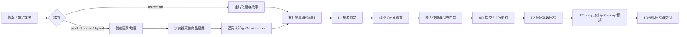

# ChronoForge · v3

[English](README.en.md) · [完整 Skill](SKILL.md)

> 面向真实商品与参考素材的多镜头广告生产流程：证据先行、市场先锁定、Omni 生成、分层质检、可追溯交付。

ChronoForge 将视频复刻、商品链接原创广告和混合改编统一为可审计管线，把商品事实、创意决策、参考图、付费任务、后期 Overlay 与最终母版绑定在同一条 provenance 链上。

## 核心流程



商品链接未给出国家/地区时，流程停在 `market_gate`，不会从域名自行推断。市场锁定后，人物、语言、口播、字幕、Overlay、单位、货币、场景、服装和 CTA 全程不得漂移。

## 技术亮点

- **三路由统一契约**：`recreation`、`product_video`、`hybrid` 共用版本化 story、timeline、plan 和 QA schema。
- **证据完整性硬门禁**：主图、SKU、详情图、视频海报全部保留；manifest 与逐图分析必须一一对应。
- **商品身份锁定**：canonical photo、identity grid、storyboard 和 state contract 分工明确，减少 SKU 漂移与幻觉部件。
- **低风险创意路由**：先评估安装、折叠、连接、承重等物理风险；高风险商品默认保持已验证 ready state。
- **Omni 专用模型路线**：独立镜头用 `omni_flash-10s`，连续接拍用 `omni_flash-10s-fl`，可变时长才用 `omni-flash`。
- **提示词预算保护**：提交前强制控制 4,000 字符上限，保留身份、SKU、动作边界和音频必需条款。
- **安全付费执行**：能力快照、模型 hash、参考锁、提交意图、task 复用和结果对账全部留痕。
- **并行轮询与可恢复**：独立任务并行轮询；失败、超时和下载中断不会盲目重复 POST。
- **L1/L2/L3 分层 QA**：分别检查参考身份、动作/状态/音频、整片故事/接缝/文字可读性。
- **本地化 Overlay 默认**：紧凑半透明灰色矩形、白色粗体本地语言文字、深色描边；逐镜头避开产品、手部、脸和 proof action。
- **明确音频策略**：支持 `native`（目标市场人物对白）、`post_voiceover`（后期目标语言旁白）和 `ambient/ASMR`（无说话，仅产品与环境声）。
- **可追溯交付**：原始容器、引用、请求、hash、QA 报告和最终母版分离保存，拒绝静态图拼贴冒充生成视频。

## 三条路线

| 输入 | 路线 | 关键产物 |
|---|---|---|
| 上传/本地视频 | `recreation` | 全片时间码、画面/音频证据、故事与状态映射 |
| 商品链接 | `product_video` | 市场锁定、完整商品证据、原创整片广告 |
| 商品链接＋上传视频 | `hybrid` | 商品事实约束下的明确改编映射 |

商品采集使用已安装的 `product-ugc-pipeline`，并优先通过 `ego-browser` 复用登录与地区上下文。

## 快速开始

要求 Python 3.10+、FFmpeg/ffprobe；付费运行面向 macOS/Linux。

```bash
git clone --branch v2 https://github.com/peipeijiang/chronoforge.git
cd chronoforge
python3 scripts/init_run.py --product-url 'https://shop.example/product' --duration 30 --out /path/product-run
python3 scripts/compile_prompt.py --run-dir /path/product-run --plan /path/product-run/manifests/execution-plan.json --job C01 --output /path/product-run/requests/video/C01-v1.json
python3 scripts/updrama_runtime.py preflight --run-dir /path/product-run --models tt-image-2.5 omni_flash-10s
python3 scripts/updrama_runtime.py validate /path/product-run/requests/video/C01-v1.json --ready --run-dir /path/product-run
```

付费提交需要批准的本地凭证和明确确认短语；没有能力快照、参考锁或付费授权时，流程停在对应 gate，不降级为静态图或本地 mock。

## 本地化与后期规范

- **市场**：产品链接路线先确认 `country_or_region`、`language`、`locale` 与人物/声音约束。
- **Overlay**：每个 beat 最多一条简短买点卡，放在顶部或中上方安全区；避开产品、手部、脸和功能证明动作，底部平台安全区保持干净。
- **音频**：`native` 必须写出完整目标语言台词；`post_voiceover` 只生成环境音，后期混音后才有人声；`ambient/ASMR` 明确禁止对白和旁白。
- **画面**：Omni 生成 text-free visuals；Overlay、字幕和旁白属于后期编辑，任何文字/音频变更都要重新 L3。

## 目录与审计

```text
RUN/
├── evidence/product/  # manifest、逐图分析、brief、images/
├── analysis/          # claim ledger、风险与故事分析
├── manifests/         # timeline、plan、artifact/delivery manifest
├── requests/video/    # 编译后的 provider 请求
├── provider/          # 能力快照、契约 review、任务对账
├── media/containers/  # Omni 原始容器
├── media/master/      # 后期文字/音频后的母版
└── qa/                # L1/L2/L3 报告与抽帧证据
```

## 规范与测试

- [三条路线及证据](references/route-workflows.md)
- [整片提示词与引用图](references/prompt-and-reference-contract.md)
- [付费与恢复](references/provider-runtime.md)
- [模型契约](references/updrama-contract.md)
- [分路线 QA](references/qa-contract.md)
- [参考资产与锁定](references/reference-execution.md)
- [装配及交付](references/delivery-and-canary.md)
- [历史 v2 审计](references/v2-restoration-audit.md)

```bash
python3 -m unittest discover -s tests -v
```

测试使用合成素材和模拟服务验证流程结构、去重、锁定、引用、时间线及装配；真实付费前仍需完成供应商能力检查和实际视觉/音频审核。
