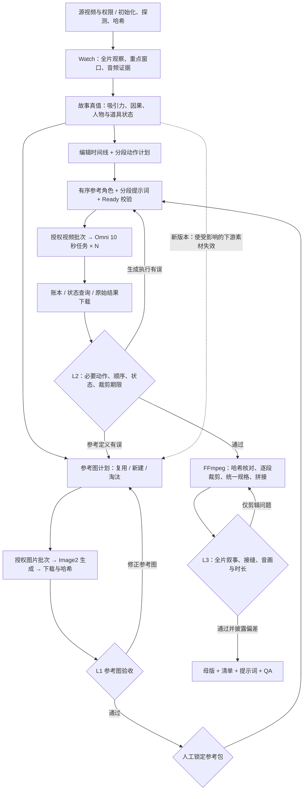

<div align="center">

**简体中文** · [English](README.en.md)

# ChronoForge · v2

面向长视频复刻的 Agent Skill：理解源片、锁定参考图、分段生成、验收后精确拼接。

[](https://github.com/peipeijiang/chronoforge/actions/workflows/validate.yml)

</div>

ChronoForge 将长于模型单次生成上限的视频，编排为可追溯的多段制作流程。默认使用 UpDrama **gpt-image-2** 生成参考图、**omni_flash-10s** 生成视频，使用 FFmpeg 裁剪与拼接；无需 LoRA 训练，但模型调用仍有 API 费用。

目标是参考图约束下的结构与语义复刻，不承诺像素、动作轨迹或原声完全一致。使用前应拥有源视频与参考素材的相应权限。

## 核心功能

- **理解完整故事：** 分析吸引力、动作原因、反应、结果和伏笔回收，区分可见事实与推断。
- **保留人物与场景：** 为身份、环境、道具和关键状态分配参考图角色，按镜头组合有序参考包。
- **跨越单次时长限制：** 编辑时间线与模型任务分离，按完整动作组织分段，并在裁剪点前完成情节。
- **锁定可追溯版本：** 参考图经过 L1 检查与人工锁定；哈希和依赖记录用于识别过期素材。
- **安全恢复任务：** 提交前记录意图，重复执行复用已知任务；结果不明时先对账，不盲目再次扣费。
- **分层验收与局部返工：** 参考图、原始片段、最终母版分别验收，纯剪辑问题不触发模型重生成。

## 完整流程



人工定妆锁定是常规创作闸门；付费批次和超出已有授权的重试仍需单独授权。Image2 必须先生成，才有图片可供验收和锁定。

| 环节 | 产出 / 提示词重点 | 实际工具或模型 | 参考能力来源 |
|---|---|---|---|
| 源片分析 | 时间证据、吸引力、事实与不确定项 | Watch + ffprobe/FFmpeg | watch / claude-video |
| 故事与连续性 | 原因→动作→反应→结果、状态轨迹 | Agent 分析与结构校验 | ChronoForge；早期 drama-skills / LuxReal 研究 |
| 参考图 | 身份、环境、道具、关键动作状态；各图控制范围 | UpDrama gpt-image-2 | ChronoForge 参考图协议 |
| 视频编排 | 有序参考角色、局部动作时间、切镜、裁剪期限、音频和排除项 | Agent 编排；omni_flash-10s | ChronoForge；早期 storyboard/video-prompts 研究 |
| 任务执行 | 当前接口契约、提交意图、任务状态、媒体哈希 | updrama_runtime.py | 原 UpDrama 接入说明与实际生产适配器 |
| 验收返工 | 必要节拍的时间证据、状态与接缝、偏差披露 | Agent 观察 + media_qa.py | ChronoForge L1/L2/L3 |
| 拼接交付 | 保留区间、累计帧预算、统一编码规格 | FFmpeg + assemble.py | 原生产装配流程 |

“参考能力来源”不表示每次都调用那些 Skill，也不代表仓库内置了它们。Watch 是外部分析依赖，其余编排由 ChronoForge 主导。

## 固定 10 秒模型如何复刻更长视频

一个 33.111723 秒案例采用下列语义分段：

| 容器 | 模型输出 | 实际保留 | 剩余内容 |
|---|---:|---:|---|
| C01 | 10 秒 | 10 秒 | 无 |
| C02 | 10 秒 | 7 秒 | 完成动作后的稳定停留，裁掉 |
| C03 | 10 秒 | 10 秒 | 无 |
| C04 | 10 秒 | 6.111723 秒 | 完成动作后的稳定停留，裁掉 |

四次生成共 40 秒素材，编辑目标为 33.111723 秒；60 fps 输出为 1987 帧，约 33.116667 秒，量化差约 +0.004944 秒。分段方式是案例，不是所有视频的固定模板；原片切镜与生成提示词中的局部切镜分别记录。

## 安装与开始

需要支持 `SKILL.md` 的 Agent、Python 3.10+、FFmpeg、ffprobe。付费适配器目前面向 macOS/Linux。

```bash
git clone --branch v2 https://github.com/peipeijiang/chronoforge.git ~/.agents/skills/chronoforge
```

已有安装请先备份，不要直接覆盖未提交的本地修改。在 Agent 中调用：

```text
$chronoforge 分析并复刻 /path/to/source.mp4。
图片使用 UpDrama Image2，视频使用 omni_flash-10s。
先完成故事分析、参考图计划和非付费校验。
```

从 Skill 目录初始化非付费 Run：

```bash
python3 scripts/init_run.py /path/to/source.mp4 --out /path/to/run --provider-clip-seconds 10 --aspect-ratio 9:16
```

后续操作由 [SKILL.md](SKILL.md) 引导。[参考图与版本操作指南](references/reference-execution.md) 提供登记、QA、锁定、失效和验收命令；[付费执行指南](references/provider-runtime.md) 提供预检、提交、恢复与下载命令。

API Key 仅从 `UPDRAMA_API_KEY` 环境变量读取，不写入清单或 Git。仓库不会自动读取聊天中的 Key。

## 内置脚本

| 脚本 | 用途 | 付费 |
|---|---|---|
| init_run.py | 初始化、源片探测与哈希 | 否 |
| validate_story.py / validate_timeline.py | 故事结构、时间覆盖和分段检查 | 否 |
| validate_plan.py | 必要节拍覆盖、参考角色、裁剪期限和 QA 记录检查 | 否 |
| workflow.py | 素材登记、依赖哈希、QA 记录、人工锁定和下游失效 | 否 |
| updrama_runtime.py | 接口快照、计划/Ready 校验、提交、恢复和下载 | 仅 submit |
| media_qa.py | 全量解码、探测、带时间的抽帧证据；语义判断仍待完成 | 否 |
| assemble.py | 输入哈希校验、累计帧预算、裁剪、拼接、母版报告 | 否 |

运行离线测试：

```bash
python3 -m unittest discover -s tests -v
```

## v2 恢复内容与边界

[v2 审计记录](references/v2-restoration-audit.md) 对照了历史生产中的遗漏、修复和证据边界。[脱敏案例](assets/cat-coffee-v3/execution-plan.json) 包含完整分段计划、有序参考角色，以及当时实际使用的 Image2/Omni 提示词；其中的视频版本 V3 不等于 Skill 分支版本 v2。案例未附媒体、私有地址或有效授权，不能直接提交。

这仍是 Agent 引导的制作协议，不是一键克隆器。结构校验不会理解故事，记录的批准不能代替真实授权，依赖检查无法发现未登记的关系。接口快照需人工或 Agent 阅读核验；这次升级没有重新验证线上模型效果或发起付费生成。当前拼接器支持生成音轨或无声母版，原声音轨复用需独立编排与同步检查。

## 许可证

目前未选择许可证。源码可公开查看；添加许可证前，复用需获得仓库所有者许可。
